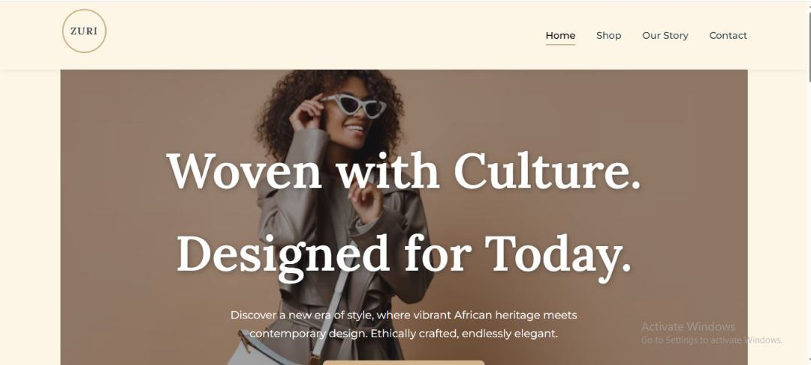

Below is a comprehensive README.md file for your ZURI fashion website project. It provides an overview of the project, its structure, setup instructions, features, technologies used, and other relevant details. The README is written in Markdown format, suitable for hosting on platforms like GitHub, and is tailored to reflect the entire project, including the newly added contact.html page and the organized folder structure with external CSS and JavaScript files.

---

# ZURI Fashion Website

ZURI is a modern e-commerce website that blends vibrant African prints with contemporary fashion design. The site showcases ethically crafted, elegant apparel, celebrating cultural heritage while offering a seamless shopping experience. This project is a static, front-end prototype designed to demonstrate a responsive and visually appealing interface for a fashion brand.

## Table of Contents
- [Project Overview](#project-overview)
- [Features](#features)
- [Folder Structure](#folder-structure)
- [Technologies Used](#technologies-used)
- [Setup Instructions](#setup-instructions)
- [Usage](#usage)
- [Contributing](#contributing)
- [Future Enhancements](#future-enhancements)

## Project Overview
ZURI is a fictional fashion brand focused on sustainable, African-inspired clothing. This static website serves as a prototype for an e-commerce platform, featuring a homepage, product listings, product details, shopping cart, checkout, user authentication (login/signup), an "Our Story" page, and a contact page. The design emphasizes accessibility, responsiveness, and a modern aesthetic with smooth animations and intuitive navigation.

The project is built using vanilla HTML, CSS, and JavaScript, with a modular structure to facilitate future integration with JavaScript frameworks (e.g., React, Vue.js) or a backend (e.g., Express.js).

## Features
- *Responsive Design*: Optimized for mobile, tablet, and desktop devices with a mobile-first approach.
- *Interactive Navigation*: Sticky navigation with a mobile menu toggle and active link highlighting.
- *Product Showcase*: A dynamic product grid with hover effects, linking to detailed product pages.
- *Shopping Cart*: A functional cart page displaying items, quantities, and subtotal, with remove functionality.
- *Checkout Process*: A form for entering shipping and payment details (demo, no real payment processing).
- *User Authentication*: Login and signup forms for user account management.
- *Our Story Page*: A narrative section highlighting the brand’s mission and heritage.
- *Contact Page*: A form for user inquiries, with additional contact details (email, phone, address).
- *Accessibility*: ARIA labels and semantic HTML for improved screen reader compatibility.
- *Smooth Scrolling*: Enhanced user experience with smooth scroll behavior and a "Go to Top" button.

## Folder Structure

/zuri-fashion-website/
├── 📄 index.html              # Homepage with hero and featured products
├── 📄 shop.html               # Product listing page
├── 📄 product-detail.html     # Individual product details with add-to-cart form
├── 📄 cart.html               # Shopping cart summary
├── 📄 checkout.html           # Checkout form for shipping and payment
├── 📄 login.html              # User login form
├── 📄 signup.html             # User signup form
├── 📄 our-story.html          # Brand story and mission
├── 📄 contact.html            # Contact form and details
└── 📁 assets/
    ├── 📁 css/
    │   └── 📄 style.css       # All CSS styles for the website
    ├── 📁 js/
    │   └── 📄 main.js         # JavaScript for navigation, scroll effects, and menu toggle
    └── 📁 images/
        ├── 📄 logo.svg        # ZURI logo
        ├── 📄 aba-blouse.jpg  # Placeholder product image
        └── 📄 ife-dress.jpg   # Placeholder product image

## Technologies Used
- *HTML5*: Semantic markup for structure and accessibility.
- *CSS3*: Custom styles with CSS variables, flexbox, grid, and media queries for responsiveness.
- *JavaScript*: Vanilla JS for interactivity (e.g., mobile menu, scroll effects, active nav links).
- *Fonts*: Google Fonts (Lora for headings, Montserrat for body text).
- *Icons*: SVG icons for navigation and social links.
- *External Resources*: Unsplash for product image placeholders.

## Setup Instructions
To run the ZURI website locally, follow these steps:

1. *Clone or Download the Repository*:
   bash
   git clone https://github.com/your-username/zuri-fashion-website.git
   
   Alternatively, download the project as a ZIP file and extract it.

2. *Navigate to the Project Directory*:
   bash
   cd zuri-fashion-website
   

3. *Open the Website*:
   - Option 1: Open index.html directly in a web browser (e.g., Chrome, Firefox).
   - Option 2: Serve the project using a local development server for a better experience:
     bash
     npm install -g live-server
     live-server
     
     This will launch the website at http://localhost:8080.

4. *Explore the Pages*:
   Navigate through the site using the links in the navigation bar (Home, Shop, Our Story, Contact, Login, Cart).

## Usage
- **Homepage (index.html): View the hero section and featured products. Click "Explore The Collection" to visit the shop.
- **Shop (shop.html): Browse all products with hover effects linking to product details.
- **Product Detail (product-detail.html): View product information and select size/quantity.
- **Cart (cart.html): Review cart items, adjust quantities, or proceed to checkout.
- **Checkout (checkout.html): Fill out shipping and payment details (demo only).
- **Login/Signup (login.html, signup.html): Simulate user account creation and login.
- **Our Story (our-story.html): Learn about ZURI’s mission and heritage.
- **Contact (contact.html): Submit inquiries via the form or view contact details.

The site is static, so forms (e.g., signup, contact) do not process data. To add functionality, integrate a backend (see [Future Enhancements](#future-enhancements)).

## Contributing
Contributions are welcome! To contribute:
1. Fork the repository.
2. Create a new branch (git checkout -b feature/your-feature).
3. Make changes and commit (git commit -m "Add your feature").
4. Push to your branch (git push origin feature/your-feature).
5. Open a pull request with a description of your changes.

Please ensure code follows the project’s style guide (consistent indentation, semantic HTML, and CSS variable usage).

## Future Enhancements
- *Backend Integration*: Add a Node.js/Express.js backend to handle form submissions (e.g., contact, signup) and store cart/order data.
- *Framework Migration*: Convert the front-end to a JavaScript framework like React or Vue.js for reusable components and state management.
- *Form Validation*: Implement client-side validation for forms (e.g., email format, required fields) using JavaScript.
- *Payment Processing*: Integrate a payment gateway (e.g., Stripe, Paystack) for real checkout functionality.
- *SEO Optimization*: Use a static site generator like Next.js or Gatsby for better search engine visibility.
- *Map Integration*: Add a Google Maps embed on the contact page for the store address.
- *Dynamic Cart*: Enable real-time cart updates using localStorage or a backend API.
